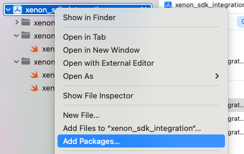
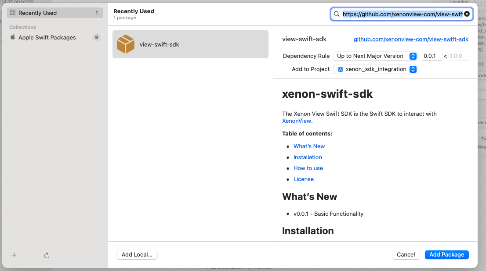
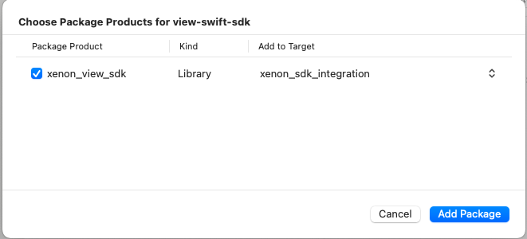
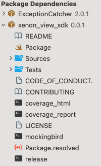

# xenon-swift-sdk
The Xenon View Swift SDK is the Swift SDK to interact with [XenonView](https://xenonview.com).

**Table of contents:**

* [What's New](#whats-new)
* [Installation](#installation)
* [How to use](#how-to-use)
* [License](#license)

## <a name="whats-new"></a>
## What's New
* v0.0.17 - Support macOS 12.0, iOS 15.0, watchOS 8.0, tvOS 15.0 and above, allow for compile for older versions.
* v0.0.5 - Switched to SwiftyJSON based API responses, verses generics.
* v0.0.4 - More flexible APIs
* v0.0.3 - remove test dependencies from release
* v0.0.2 - Fixed headers bug
* v0.0.1 - Basic Functionality

## <a name="installation"></a>
## Installation

You can install the Xenon View SDK from [Github](https://github.com/xenonview-com/view-swift-sdk):

### Via Swift Package Manager

Add to your dependencies section:
```swift
dependencies: [
        // Dependencies declare other packages that this package depends on.
        // .package(url: /* package url */, from: "1.0.0"),
        .package(url:"https://github.com/xenonview-com/view-swift-sdk", from: "0.0.17"),
        ...
```
Then including as a dependency in your app in the targets section:
```swift
    targets: [
        // Targets are the basic building blocks of a package. A target can define a module or a test suite.
        // Targets can depend on other targets in this package, and on products in packages this package depends on.
        .target(
            name: "<your app name>",
            dependencies: ["xenon_view_sdk"]),
```

### Via Xcode (per version 14)

1) Right-click on your top-level project and select ```Add Packages...```:




2) Paste into the search bar ```https://github.com/xenonview-com/view-swift-sdk``` and click ```Add Package```:




3) Select ```xenon_view_sdk``` and click ```Add Package```:




4) Ensure Xenon SDK is installed by viewing ```Package Dependencies```:



## <a name="how-to-use"></a>
## How to use

The Xenon View SDK can be used in your application to provide a whole new level of user analysis and insights. You'll need to embed the instrumentation into your application via this SDK. The basic operation is to create a customer journey by adding steps in the journey like page views, funnel steps and other events. The journey concludes with an outcome. All of this can be committed for analysis on your behalf to Xenon View. From there you can see popular journeys that result in both successful an unsuccessful outcomes. Additionally, you can deanonymize journeys. This will allow for a deeper analysis of a particular user. This is an optional step as just tracking which journey results in what outcome is valuable.

### Instantiation
The View SDK is a Swift package you'll need to include in your application. After inclusion, you'll need to init the singleton object:

```swift
import xenon_view_sdk

// start by initializing Xenon View
Xenon().initialize(apiKey:"<API KEY>")
```

Typically, this would be done during app initialization:
```swift 
import xenon_view_sdk

@main
struct ExampleApp: App {
    // register initial Xenon parameters every launch
    init() {
        // start by initializing Xenon View
        Xenon().initialize(apiKey:"<API KEY>")
    }
    
    var body: some Scene {
        WindowGroup {
            ContentView()
        }
    }
}
```

Of course, you'll have to make the following modifications to the above code:
- Replace `<API KEY>` with your [api key](https://xenonview.com/api-get)

> **Note:** For older OS support, surround your calls with: 

```swift
if #available(macOS 12.0, iOS 15.0, watchOS 8.0, tvOS 15.0, *) {
    Xenon().initialize(apiKey:"<API KEY>")
}
```

### Platforming
After you have initialized View, you can optionally specify platform details such as:
- Operating System version (iOS) See [OperatingSystemVersion](https://developer.apple.com/documentation/foundation/operatingsystemversion)
- Device model (iPhone, iPad, etc.) See [DeviceKit](https://github.com/devicekit/DeviceKit)
- Software version of your application.

```swift
import xenon_view_sdk

let softwareVersion = "x.y.z" // use your app version
let deviceModel = "iPhone 11 Pro"
let operatingSystemVersion = "16.0.2"

// you can add platform details to outcomes
try! Xenon().platform(softwareVersion: softwareVersion, deviceModel: deviceModel, operatingSystemVersion: operatingSystemVersion)
```
This adds platform details for each [outcome](#outcome). Typically, this would be set once at initialization:
```swift
import DeviceKit
import xenon_view_sdk

@main
struct ExampleApp: App {
    // register initial Xenon parameters every launch
    init() {
        // start by initializing Xenon View
        Xenon().initialize(apiKey:"<API KEY>")
        let os = ProcessInfo().operatingSystemVersion
        let softwareVersion = "5.1.5"
        let deviceModel = "\(Device.current)"
        let operatingSystemVersion = "\(os.majorVersion).\(os.minorVersion).\(os.patchVersion)"

        try! xenon.platform(softwareVersion: softwareVersion, deviceModel: deviceModel, operatingSystemVersion: operatingSystemVersion)
    }
    
    var body: some Scene {
        WindowGroup {
            ContentView()
        }
    }
}
```

### Add Journeys
After you have initialized the View singleton, you can start collecting journeys.

There are a few helper methods you can use:
#### <a name="outcome"></a>
#### Outcome
You can use this method to add an outcome to the journey.

```swift
import xenon_view_sdk

// you can add an outcome to journey
let outcome = "<outcome>"
let action = "<custom action>"
try! Xenon().add(outcome: outcome, action: action)
```
This adds an outcome to the journey chain effectively completing it.


#### Page view
You can use this method to add page views to the journey.

```swift
import xenon_view_sdk

// you can add a page view to a journey
let page = "test/page"
try! Xenon().add(pageView: page)
```
This adds a page view step to the journey chain.


#### Funnel Stage
You can use this method to track funnel stages in the journey.

```swift
import xenon_view_sdk

// you can add a funnel stage to a journey
let stage = "<stage in funnel>"
let action = "<custom action>"
try! Xenon().add(funnelStage: stage, action: action)
```
This adds a funnel stage to the journey chain.


#### Generic events
You can use this method to add generic events to the journey.

```swift
import xenon_view_sdk

// you can add a generic event to journey
let event = [
    "category": "Event",
    "action": "test"
]
try! Xenon().add(event: event)
```
This adds an event step to the journey chain.

### Committing Journeys

Journeys only exist locally until you commit them to the Xenon View system. After you have created and added to a journey, you can commit the journey to Xenon View for analysis as follows:
```swift
import xenon_view_sdk

// you can commit a journey to Xenon View
try! Xenon().commit()
```
This commits a journey to Xenon View for analysis.

### Deanonymizing Journeys

Xenon View supports both anonymous and known journeys. By deanonymizing a journey you can compare a user's path to other known paths and gather insights into their progress. This is optional.
```swift
import xenon_view_sdk

// you can deanonymize before or after you have committed journey (in this case after):
let person = [
    "name": "Test User",
    "email": "test@example.com"
]
try! await opSubject.deanonymize(person: person)

// you can also deanonymize with a user ID:
let person = [
  "UUID": "<some unique ID>"
]
try! await opSubject.deanonymize(person: person)
```
This deanonymizes every journey committed to a particular user.

> **Note:** With journeys that span multiple platforms (eg. Website->iPhone->API backend), you can merge the journeys by deanonymizing on each platform.


### Journey IDs
Each Journey has an ID akin to a session. After an Outcome occurs the ID remains the same to link all the Journeys. If you have a previous Journey in progress and would like to append to that, you can set the ID.

> **Note:** For Swift, the ID is a static variable. For multiple threads, the Journey ID will be reused.


After you have initialized the Xenon singleton, you can:
1. Use the default UUID
2. Set the Journey (Session) ID
3. Regenerate a new UUID

```swift
import xenon_view_sdk
// by default has Journey id
expect(Xenon().id()).notTo(beNil())
expect(Xenon().id()).notTo(equal(""))

// you can also set the id
let testId = "<some random uuid>"
Xenon().id(_id: testId)


// lastly you can generate a new one (useful for serialized async operations that are for different customers)
Xenon().newId()
expect(Xenon().id()).notTo(beNil())
expect(Xenon().id()).notTo(equal(""))
```


### Error handling
In the event of an API error when committing, the method returns a [Task](https://developer.apple.com/documentation/swift/task).

> **Note:** The default handling of this situation will restore the journey (appending newly added pageViews, events, etc.) for future committing. If you want to do something special, you can do so like this:

```swift
import xenon_view_sdk

// you can handle errors if necessary
do {
    let result = try await opSubject.commit().value
    switch result {
    case .success(let dictionary):
        print(dictionary)
    case .failure(let error):
        //... handle server side error ...
        print(error)
    }
} catch {
    //... handle local error ...
    print(error)
}

```

## <a name="license"></a>
## License

Apache Version 2.0

See [LICENSE](https://github.com/xenonview-com/view-swift-sdk/blob/main/LICENSE)

